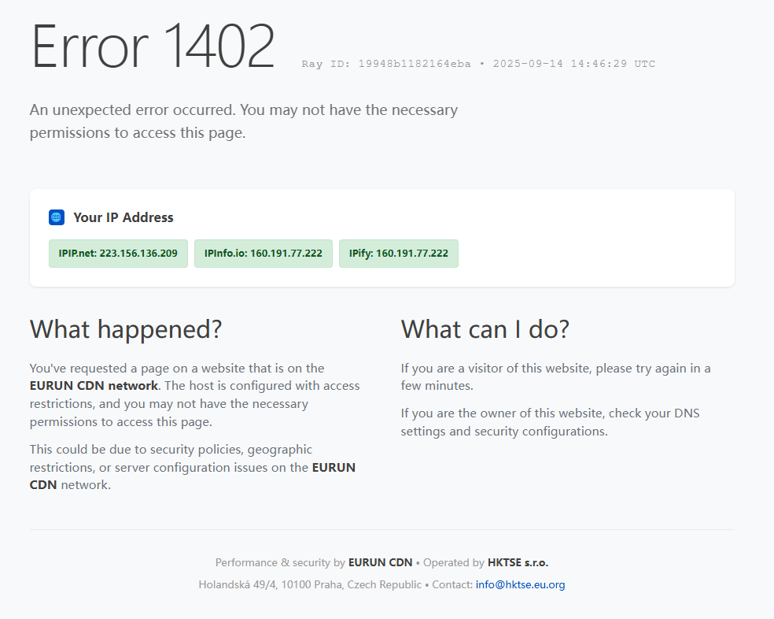
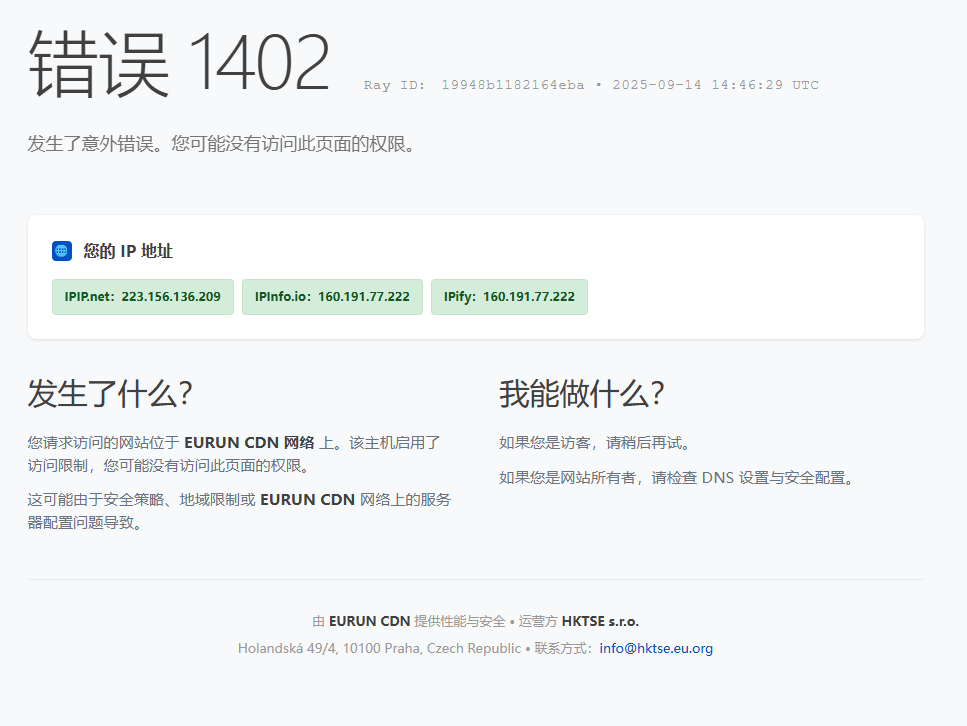

# Error 1402 – Fake Error Page (Static Single Page)

Language: [简体中文](./README.md) | English

## Screenshots

English



Chinese



A static error page template intended to mask or cover real services. It mimics a CDN-style error page (sample copy styled as "EURUN CDN"), featuring a Ray ID, UTC timestamp, and multi-source IP detection. It helps reduce real service exposure or provide a uniform error appearance when access is restricted.

> Note: "Error 1402" is not a standard HTTP status code. It's intentionally ambiguous. Your actual HTTP status code should be set by your server/reverse proxy (commonly 403 or 404).


## What is this

- Purpose: Provide a frontend-only static page that looks like a CDN/security device error page, to obscure backend apps or serve as a unified landing page for restricted access.
- Form: Single-file `index.html` with inline CSS/JS, no external dependencies.
- Highlights:
  - Pseudo Ray ID (click to copy) and UTC timestamp;
  - Concurrent IP detection from three public sources (IPIP, IPInfo, IPify) with success/failure indication;
  - Responsive layout for desktop and mobile;
  - Easily replaceable branding copy, company info, contact email;
  - Clean code and easy customization.


## Quick start (Deploy)

You can host `index.html` on any static hosting or web server:

- Static hosting: GitHub Pages / Cloudflare Pages / Vercel / Netlify, etc.
- Traditional servers: Nginx / Apache / Caddy — use it as site root or default page for a specific path.
- Reverse proxy fronting: as a fallback/default page or error page (e.g., 403/404) response.

Recommended scenarios:
- As the default site for unknown/unconfigured hostnames.
- As the error page for 403/404.
- As a temporary placeholder during maintenance or cutover.

> Tip: For obfuscation, the page title/copy shows "Error 1402", while your server can still return common status codes (e.g., 403/404/503). The look and feel is preserved.

### Template static page (JS 302 redirect, cleanest)

Save the following as `error-1402-redirect.html` (or use it as your `index.html`):
```html
<!DOCTYPE html>
<html lang="en">
<head>
  <meta charset="UTF-8">
  <title>Error 1402 - EURUN CDN</title>
  <meta name="robots" content="noindex">
</head>
<body>
  <script>
    // Minimal: no path/query passthrough
    location.replace('https://error-1402.vercel.app/');
  </script>
</body>
</html>
```

Minimalist HTML with the smallest file size, ideal for use directly as an Nginx error page
```html
<!DOCTYPE html>
<meta charset="UTF-8">
<title>Error 1402</title>
<script>location.replace('https://error-1402.vercel.app/');</script>
```

Features:
- Works without <html>, <head>, or <body> tags thanks to automatic completion by modern browsers.
- The file size is minimal, only 127 bytes.
- Instantly redirects upon opening the page, with no visible content displayed.
Optional: preserve original path/query (may expose sensitive params; use with care):

```html
<script>
  location.replace('https://error-1402.vercel.app' + location.pathname + location.search + location.hash);
</script>
```


### One-click deploy

Use these buttons to clone from this repo and deploy in one go:

- [](https://vercel.com/new/clone?repository-url=https://github.com/yuanweize/Error-1402&project-name=error-1402&repository-name=Error-1402)
- [](https://app.netlify.com/start/deploy?repository=https://github.com/yuanweize/Error-1402)
- [](https://dash.cloudflare.com/?to=/:account/pages/create)
- [](https://render.com/deploy?repo=https://github.com/yuanweize/Error-1402)

Notes:
- Vercel/Netlify/Render build and host static sites directly from GitHub;
- Cloudflare Pages button opens the Pages creation flow where you connect your GitHub repo;
- For “single-file deploy”, you can also just upload `index.html` to these providers.


## Reverse proxy/Nginx idea (pseudo)

- Put `index.html` in a readable directory;
- Map 403/404 errors to this file;
- Or return this file as the default for a fallback server block.

Adjust for production needs (TLS, hostname matching, caching policy, etc.).


## Ready-to-copy server configs

All examples use Linux-style paths. Replace `/var/www/error1402` with your actual directory.

### Nginx

1) Map to error page (preserve real status, recommended)

```nginx
server {
    listen 80;
    server_name example.com;

    # your normal site config ...

    # replace body for 403/404/503 with fake page, keep status code
    error_page 403 /error-1402.html;
    error_page 404 /error-1402.html;
    error_page 503 /error-1402.html;

    # Option A: a separate file name to avoid index conflicts
    location = /error-1402.html {
        root /var/www/error1402;   # directory contains index.html (you can copy/rename)
        internal;                  # only for internal redirects via error_page
        default_type text/html;
        add_header Cache-Control "no-store";
    }
    # Option B: reuse index.html directly (choose one)
    # location = /error-1402.html {
    #     alias /var/www/error1402/index.html;
    #     internal;
    #     default_type text/html;
    #     add_header Cache-Control "no-store";
    # }
}
```

2) As default/fallback site (for unmatched hostnames)

Return 404 but render fake page body:

```nginx
server {
    listen 80 default_server;
    server_name _;

    error_page 404 /index.html;
    location = /index.html {
        root /var/www/error1402;
        internal;
        default_type text/html;
        add_header Cache-Control "no-store";
    }
    location / {
        return 404;
    }
}
```

Serve with 200 directly (no error code):

```nginx
server {
    listen 80 default_server;
    server_name _;
    root /var/www/error1402;

    location / {
        try_files /index.html =404;  # always serves index.html with 200
        add_header Cache-Control "no-store";
    }
}
```

### Apache (httpd)

1) Map to error page (preserve real status)

Place the fake page file under your site DocumentRoot (name it `error-1402.html` or reuse `index.html`).

```apache
# inside vhost or .htaccess
ErrorDocument 403 /error-1402.html
ErrorDocument 404 /error-1402.html
ErrorDocument 503 /error-1402.html

# optional: headers for the directory
<Directory "/var/www/error1402">
    Options -Indexes
    AllowOverride None
    Require all granted
    <IfModule mod_headers.c>
        Header set Cache-Control "no-store"
    </IfModule>
    AddType text/html .html
    DefaultType text/html
    CharsetSourceEnc UTF-8
    AddDefaultCharset UTF-8
</Directory>
```

2) Default/fallback vhost (keep 403 or 404)

Example: always return 403 with the fake page body.

```apache
<VirtualHost *:80>
    ServerName _default_
    DocumentRoot "/var/www/error1402"

    # always return 403 (Forbidden)
    <IfModule mod_rewrite.c>
        RewriteEngine On
        RewriteRule ^ - [F]
    </IfModule>

    # use fake page as 403 body
    ErrorDocument 403 /index.html

    <Directory "/var/www/error1402">
        Options -Indexes
        AllowOverride None
        Require all granted
        <IfModule mod_headers.c>
            Header set Cache-Control "no-store"
        </IfModule>
    </Directory>
</VirtualHost>
```

To return 404 instead:

```apache
RewriteRule ^ - [R=404]
ErrorDocument 404 /index.html
```

### Caddy v2

1) Map to error page (preserve real status)

```caddyfile
example.com {
    # your normal site ...

    handle_errors {
        @4xx expression {http.error.status_code >= 400 && http.error.status_code < 500}
        rewrite @4xx /index.html
        file_server
    }
}
```

2) Default/fallback site

Keep error code example (403):

```caddyfile
:80 {
    root * /var/www/error1402
    respond / 403

    handle_errors {
        rewrite * /index.html
        file_server
    }
}
```

Serve 200 directly:

```caddyfile
:80 {
    root * /var/www/error1402
    try_files /index.html
    file_server
}
```

> Heads-up: TLS is omitted in samples. For production, add HTTPS, HSTS, caching policy, and proper access control.


## Customization & development

Edit `index.html` directly:

- Branding & copy:
  - Replace `<title>`, headings, subheadings ("What happened? / What can I do?"), footer company info, and email.
- Error code & messages:
  - Change "Error 1402" to your own label, or use common ones like "403 Forbidden".
- Ray ID & timestamp:
  - Generated on the client only (for realism). Ray ID is clickable to copy.
- IP detection:
  - See `ipServices` array; add/remove sources as needed.
  - 3 seconds timeout per source, requests run concurrently.
  - If you don't want outbound requests, empty `ipServices` or comment out `fetchUserIp()` and remove the UI.
- Styles:
  - Inline CSS; adjust colors/layout/typography as needed.
  - Responsive tweaks in `@media (max-width:768px)`.


### Languages and lazy-loaded i18n

- The top-right selector now offers 30+ common languages. Language packs are lazy-loaded from remote JSON files.
- Auto-detection priority:
  1. User-pinned language (`localStorage.lang` honored only when `localStorage.langPinned=1`, to avoid accidental lock-in)
  2. Iterate your browser language list in order; for each tag try exact first, then its base prefix (e.g., `zh-CN` → `zh`), then move to the next tag
  3. If still not found, fallback to `en`
- Loading and fallback chain: content is merged from “exact → base → built-in English baseline”, so missing keys gracefully fall back to upper levels.
- English (en) is no longer fetched from `assets/i18n/en.json`; instead, the page's DOM content serves as the English baseline. Only non-English packs are fetched on demand.
- Built-in languages (code → native name, partial list):
  - `en` English, `zh` 中文, `es` Español, `fr` Français, `de` Deutsch, `ja` 日本語, `ko` 한국어, `ru` Русский, `ar` العربية, `pt` Português, `it` Italiano, `nl` Nederlands, `sv` Svenska, `no` Norsk, `pl` Polski, `tr` Türkçe, `hi` हिन्दी, `th` ไทย, `vi` Tiếng Việt, `id` Bahasa Indonesia, `he` עברית, `uk` Українська, `cs` Čeština, `ro` Română, `el` Ελληνικά, `hu` Magyar, `da` Dansk, `fi` Suomi, `bg` Български, `sk` Slovenčina, `ca` Català, `ms` Bahasa Melayu, `fil` Filipino.
- RTL support: selecting `ar` or `he` sets `dir="rtl"`; others use `ltr`.
- Translatable keys include:
  - `title`, `error_code`, `ray_prefix`, `error_description`
  - `ip_title`, `detecting`, `ip_source_failed`, `copied`
  - `what_happened`, `what_happened_p1`, `what_happened_p2`
  - `what_can_i_do`, `what_can_i_do_p1`, `what_can_i_do_p2`
  - `footer_line1`, `footer_line2`, `sep`

#### Remote loading and caching (important)

- Remote sources (fallback in order):
  - GitHub Raw: `https://raw.githubusercontent.com/yuanweize/Error-1402/main/assets/i18n/<code>.json`
  - jsDelivr: `https://cdn.jsdelivr.net/gh/yuanweize/Error-1402@main/assets/i18n/<code>.json`
- Single-file deploy: non-English packs are fetched remotely, so you can deploy just `index.html` without bundling `assets/`.
- Caching strategy:
  - In-memory cache (per page) + localStorage persistent cache (TTL 7 days). Expired entries auto-refresh.
  - Bump script constant `I18N_LS_VERSION` to invalidate old caches.
  - Manual clear: `localStorage.removeItem('i18n:<code>:v1')`.
- Loading indicator: a small `Loading…` label is shown in the top-right during fetch.
- Custom mirrors: edit script constant `LANG_BASES` to replace/add sources (evaluated in order).

#### What is “lazy-loading” here?

- To reduce initial JS payload, the page fetches `<code>.json` remotely only when needed and caches it in memory.
- If a language file is missing or fails to load, the merge fallback keeps the page usable by falling back to the built-in English baseline.
- Deployment notes:
  - Due to browser security, opening via `file://` may block `fetch()` for JSON. Serve over a local HTTP server during development.
  - Consider caching headers for `assets/i18n/*.json`: `Cache-Control: public, max-age=86400, immutable` to avoid repeated downloads.
  - For new RTL languages, add the code to the `rtlLangs` set in the script.

#### Adding a new language

1. Copy any existing language (e.g., `zh.json`) to `assets/i18n/<code>.json` and translate all keys.
2. Add `<code>: 'Native Name'` to `languageMeta` in `index.html` so it appears in the selector.
3. If needed, set a custom `"sep"` in the JSON (e.g., `：`).
4. For new UI sections, add `data-i18n="key"` to elements and provide keys in each language JSON.

#### Debugging & troubleshooting

- Append `?debug=i18n` to the URL to show a small debug panel with: `navigator.language`, `navigator.languages`, the resolved language, final `currentLang`, and whether the language pack was loaded.
- If the first visit (with cleared localStorage) still shows an unexpected language:
  - Ensure you are not opening the file via `file://` (browsers may block `fetch()` for JSON); serve over HTTP instead.
  - Use `?debug=i18n` to inspect your browser language order.
  - Detection is now fixed to evaluate languages one-by-one (exact → base) before considering later entries, so `zh-CN` correctly falls back to `zh` instead of a later `en` entry.
  - When you manually select a language, the page sets `langPinned=1` and will honor your choice on subsequent visits.


## Privacy & compliance

- The page queries the following public services to detect the visitor's IP:
  - `https://myip.ipip.net/json`
  - `https://ipinfo.io/json`
  - `https://api.ipify.org?format=json`
- These calls share the visitor's IP with those providers (which they would see anyway as your egress IP). If privacy/compliance is critical, disable this feature or use your own IP service.
- Ensure your usage complies with local laws and your org’s security policies; avoid deceptive or illegal use.


## FAQ

1) Is "Error 1402" a real HTTP status code?

- No. It's intentionally non-standard for obfuscation. Your server sets the actual HTTP status (recommend 403/404). The page still shows the "Error 1402" label.

2) Is the Ray ID actually traceable?

- No. It's randomly generated on the client for realism only, but is copyable.

3) Why are there external requests?

- Only for the "Your IP Address" module. Disable or replace with your own service if needed.

4) Is mobile supported?

- Yes. There's a simple responsive layout that you can tweak as needed.


## Structure

```
.
├─ index.html           # main page (inline CSS/JS, remote lazy-loading of language JSON; can deploy as single file)
├─ assets/
│  └─ i18n/             # source language packs (for repo/CI only; optional for production deploy)
│     ├─ zh.json
│     ├─ es.json  …
│     └─ (more languages)
├─ README.md            # project intro (Chinese)
└─ README.en.md         # project intro (English)
```


## Size & compression tips

- Single-file static page, already quite compact.
- Further optimize by:
  - HTML/CSS/JS minification;
  - Enabling Gzip or Brotli on server;
  - Removing external IP checks to reduce first paint requests.


## Credits

- Layout and copy inspired by common CDN error pages;
- IP services: IPIP, IPInfo, IPify (demo only).

---
For deeper customization (multi-language extension, stronger mimicking, or integration with your monitoring/logging), feel free to extend `index.html`.
